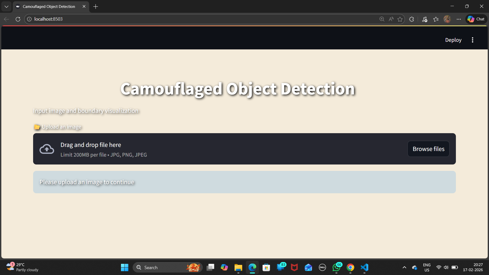

# 🦎 Camouflaged Object Detection with Boundary Localization In Complex Backgrounds
**Camouflaged Object Detection (COD)** is one of the most challenging problems in computer vision because the target objects intentionally or naturally blend into their surroundings.

This project proposes a **CNN-based deep learning framework** that not only detects camouflaged objects but also **accurately localizes their boundaries**, even in **low-contrast and complex scenes**.

## 🎯 **Objectives**

* ✅ Detect camouflaged objects in complex environments
* ✅ Accurately localize object boundaries
* ✅ Reduce background interference
* ✅ Improve robustness and generalization

---

## 📐 **System Architecture**

The proposed system is designed using a **Dual-Branch Encoder–Decoder Convolutional Neural Network (CNN)** architecture for accurate camouflaged object detection and precise boundary localization.

  

The architecture consists of:

* 🧠 **Encoder Network** → Extracts hierarchical visual features  
* 🔄 **Decoder Network** → Reconstructs spatial resolution  
* 🟢 **Segmentation Head** → Predicts binary camouflage mask  
* 🔵 **Boundary Head** → Predicts object contour map  

The dual-output design improves segmentation accuracy while ensuring sharp and precise boundary localization.

---

## 🧠 **Proposed Methodology**

The system follows a structured pipeline for detecting camouflaged objects in complex backgrounds.

### ➤ **1️⃣ Input Image Acquisition**

* RGB images are collected from benchmark datasets such as **CAMO, COD10K, and NC4K**  
* Images contain naturally or intentionally hidden objects in forests, underwater scenes, grasslands, and rocky terrains  
* Corresponding **pixel-level ground truth masks** are used for supervised training  
* Boundary maps are derived from masks for explicit contour supervision  

### ➤ **2️⃣ Image Preprocessing**

To ensure stable CNN training and uniform input size:

* Images are resized to **256 × 256** resolution  
* Pixel values are normalized to the range **[0,1]**  
* Noise reduction and enhancement applied if required  
* Ground truth masks resized accordingly  
* Boundary maps generated using edge detection techniques  
* Enhances subtle texture and edge variations critical for camouflage detection  

### ➤ **3️⃣ CNN-Based Feature Extraction (Encoder)**

The encoder extracts hierarchical features through multiple convolutional and pooling layers:

* Early layers → Capture low-level features (edges, textures)  
* Intermediate layers → Learn structural patterns  
* Deep layers → Extract high-level semantic context  
* Pooling layers → Reduce spatial dimension while preserving salient camouflage cues  

### ➤ **4️⃣ Feature Reconstruction (Decoder)**

The decoder restores spatial resolution for pixel-level prediction:

* Upsampling layers increase feature map size  
* Convolution layers refine spatial details  
* Recovers fine object contours lost during pooling  
* Essential for accurate segmentation and boundary localization
  
### ➤ **5️⃣ Dual Output Heads (Mask & Boundary Prediction)**

* 🟢 **Segmentation Mask Head** → Produces binary mask separating object from background  
* 🔵 **Boundary Head** → Predicts precise object contours  

This dual-branch supervision enhances contour sharpness and segmentation quality.

### ➤ **6️⃣ Loss Computation & Optimization**

During training:

* Mask Loss → Measures segmentation accuracy  
* Boundary Loss → Penalizes incorrect edge predictions  
* Total Loss = Combination of both losses  
* Optimizer (Adam) used for parameter updates  
* Backpropagation improves detection and boundary localization performance  

### ➤ **7️⃣ Model Validation & Performance Evaluation**

After training, the model is evaluated on unseen data:

* Quantitative Metrics → Dice Score, IoU  
* Qualitative Evaluation → Visual comparison of masks and boundary overlays  
* Boundary visualization ensures precise contour localization  

---

## 📊 **Output Results & Visualization**

The proposed Dual-Branch Encoder–Decoder CNN successfully detects camouflaged objects and generates precise boundary localization maps, even in complex and low-contrast scenes.

### ➤ **1️⃣ Web Application Interface**

The trained model is deployed as an interactive web-based inference system for real-time visualization.

  

* Drag-and-drop image upload functionality  
* Real-time boundary visualization  
* Clean and user-friendly deployment interface  
* Supports JPG, PNG, and JPEG formats  

### ➤ **2️⃣ Boundary Localization Output**

The model generates refined boundary overlays highlighting detected camouflaged objects.

  

* 🔴 Red contours represent predicted object boundaries  
* Preserves fine structural details  
* Accurately captures subtle camouflage regions  
* Maintains robustness across complex backgrounds  

### ➤ **3️⃣ Performance Highlights**

After evaluation on benchmark datasets:

* High Dice Score and IoU values  
* Improved boundary sharpness compared to single-branch models  
* Strong generalization across CAMO, COD10K, and NC4K datasets  
* Reduced background interference  

---

## 📂 **Datasets Used**

The model is trained and evaluated using **benchmark camouflaged object detection datasets** with pixel-level annotations.

### 🗂️ **CAMO Dataset**

A widely used dataset containing challenging low-contrast camouflaged scenes.

🔗 **Link:**
[https://sites.google.com/view/ltnghia/research/camo](https://sites.google.com/view/ltnghia/research/camo)

### 🗂️ **COD10K Dataset**

A large-scale camouflaged object detection dataset with diverse and complex backgrounds.

🔗 **Link:**
[https://paperswithcode.com/dataset/cod10k](https://paperswithcode.com/dataset/cod10k)

### 🗂️ **NC4K Dataset**

An extended evaluation dataset used to test the **generalization capability** of COD models.

🔗 **Link:**
[https://github.com/lartpang/awesome-segmentation-saliency-dataset](https://github.com/lartpang/awesome-segmentation-saliency-dataset)
*(Refer to the **NC4K** entry)*

---

## 🛠️ **Technologies Used**

* **Python**
* **Convolutional Neural Networks (CNN)**
* **PyTorch / TensorFlow**
* **OpenCV**
* **NumPy**
* **Matplotlib**

---

## 📁 **Folder Structure**

The project follows a **well-organized and modular folder structure** to ensure clarity, scalability, and ease of maintenance.

  

### 🗂️ **The Folder is Organised into**

* 📂 **images/** → Contains project images, visualizations, and documentation assets  
* 📂 **masks/** → Stores ground-truth segmentation masks used for training and evaluation  
* 📄 **train.py** → Trains the CNN using images, masks, and edge supervision and saves the model as codmodel.pth .
* 📄 **test.py** → Loads the trained model and predicts boundary maps. 
* 📄 **model.py** → Defines a custom encoder–decoder segmentation network.
* 📄 **metrics.py** → Computes F-measure, E-measure, IoU, Dice, and MAE.
* 📄 **splitdata.py** → Splits dataset into 80% training and 20% validation. 
* 📄 **makeedges.py** → Generates edge maps using Canny edge detection.
* 📄 **showboundary2.py** → Visualizes boundary overlays.
* 📄 **app.py** → Deploys the project using Streamlit.

---

## 🚀 **Applications**

* 🛡️ Defense and surveillance
* 🏥 Medical image analysis
* 🐾 Wildlife monitoring
* 🌊 Underwater exploration
* 🚨 Search and rescue operations

---

### ⭐ *If you like this project, don’t forget to star the repository!*

